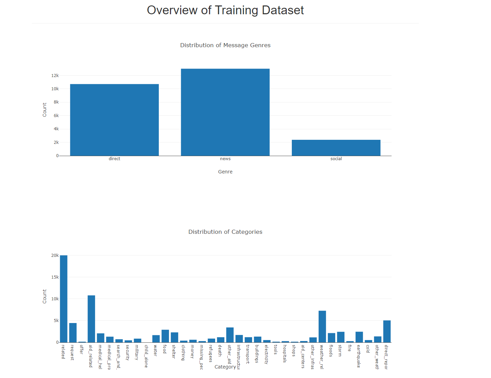
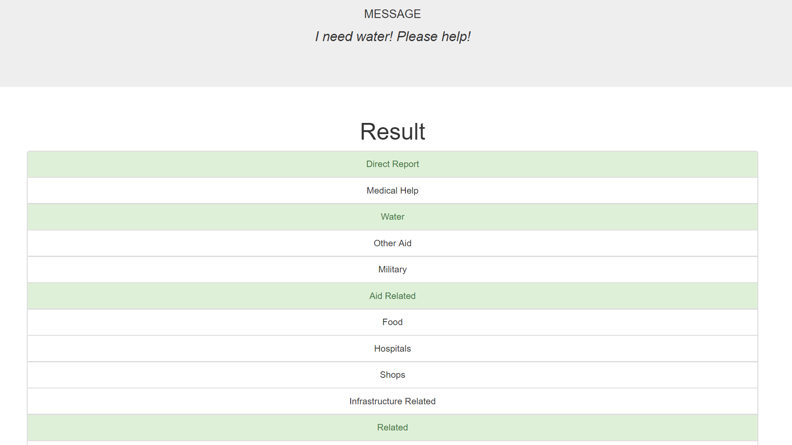

# Disaster Response Pipeline Project

This project uses machine learning to classify messages received from a natural disastter. The model was trained on more than 25,000 real messages that were sent during disaters. That data comes from [FigureEight](https://www.figure-eight.com/).

Then, the goal was to create a Dashboard using [Flask](http://flask.pocoo.org/) and [Plotly](https://plot.ly/) to display the predicted categories of an input message. 





Here is an example, where the input message is "I need water! Please help!" : 





### Installation

To download the repository, open a cmd prompt and execute 
```
git clone https://github.com/benjamin-dupuis/DataScienceNanodegree.git
```

Move into the Disaster Response project folder:

```
cd DataEngineering
cd Disaster Response Project
```

Create a virtual environment and activate it. For infos, click [here](https://uoa-eresearch.github.io/eresearch-cookbook/recipe/2014/11/26/python-virtual-env/).


Download the necessary libraries:

```
pip install -r requirements.txt
```

### Usage:
1. Run the following commands in the project's root directory to set up your database and model.

    - To run ETL pipeline that cleans data and stores in database
        `python data/process_data.py data/disaster_messages.csv data/disaster_categories.csv data/DisasterResponse.db`
    - To run ML pipeline that trains classifier and saves
        `python models/train_classifier.py data/DisasterResponse.db models/classifier.pkl`

2. Move into the app folder and run the application:
    ```
    cd app
    python run.py
    ```

3. Open a browser, and go to `localhost:3001`


### Machine Learning

The model that was selected was AdaboostClassifier. The average precision of the model over all message categories was **90%**.
The model was fine-tuned using [scikit-learn GridSearch](https://scikit-learn.org/stable/modules/generated/sklearn.model_selection.GridSearchCV.html). Also, a ML pipeline was employed using [scikit-learn Pipeline](https://scikit-learn.org/stable/modules/generated/sklearn.pipeline.Pipeline.html).

