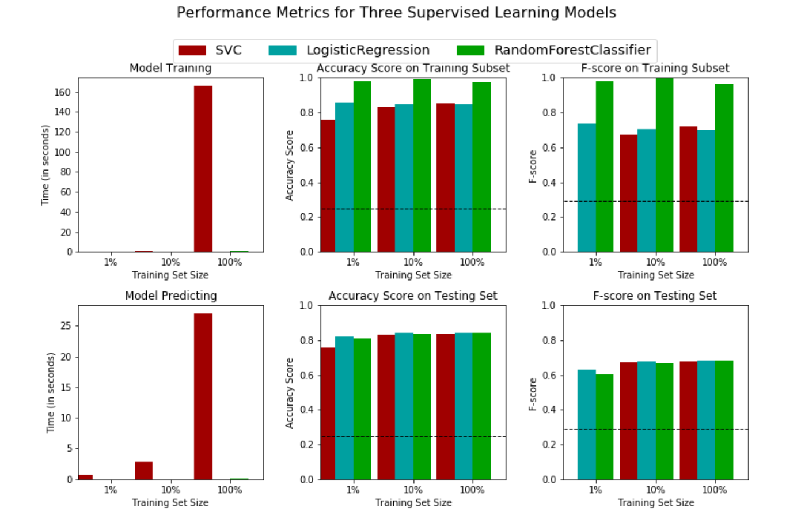
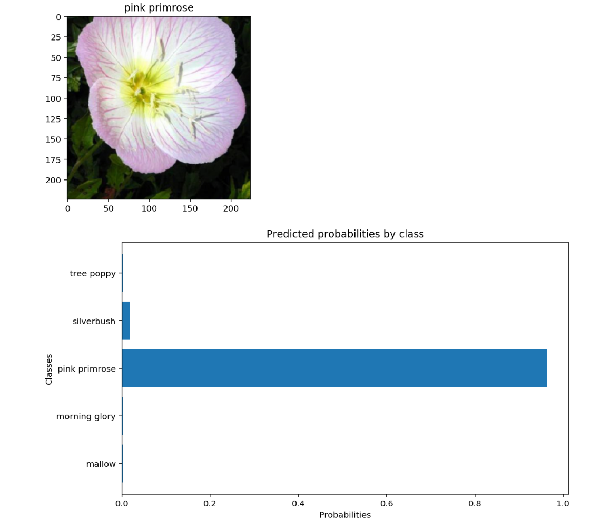

# DataScienceNanodegree
Projects made in the Uacity Data Science Nanodegree Program. IN PROGRESS.

The Udacity DataScience Nanodegree is an online program designed to teach students the tools needed to be a data scientist: data cleaning and engineering, data visualization, data mining, machine learning, deep learning, etc. The program is available here : https://www.udacity.com/course/data-scientist-nanodegree--nd025. 

The programming language used throughout the nanodegree is **Python** . 

The nanodegree is divided in different parts. In each part, there are explanatory lessons, and a project in which the students use what was learned to solve a real-world problem.  

The nanodegree sections are:

### 1. Supervised Learning: 

In this section, we learned different supervised machine learning models: Random Forest, Linear Regression, SVM, etc. We also learned how to measure their performance and compare them to use the best model for a given task. 

In the final project, I used different machine learning models to predict if an individual has an income of over 50K based on census data. For this, I compare three different machine learning models, i.e Logistic Regression, Random Forest, and SVM. I also fine tuned the hyperparameters of the best perfoming model to further improve its performance. My jupyter notebook for this project is available here: [Finding donors project](https://github.com/benjamin-dupuis/DataScienceNanodegree/tree/master/Supervised%20Learning/Finding%20Donors%20Project). 

**Technologies used**: Scikit-Learn, Numpy, Pandas, Matplotlib.

 

 

### 2. Deep Learning: 

In this section, we learned how neural networks work in details. We learned the backpropagation algorithm, the activation functions, the regularization techniques, etc. We also learned [Pytorch](https://pytorch.org/), an open-source deep learning framework. 

In the final project, we had to create an image classifier that was able to classify different species of flowers by their image. For this, we had to use *transfer learning*, which is a technique that utilizes a pre-trained deep learning model to continue its trainign on new data. In our case, the new data was the dataset containing the images of the flower species. We also had to create an app that enabled the user to use our code and allowed him to choose his own architecture, hyperparameters, whether or not he wanted to use a GPU, etc. My project can be found here: 
[Image Classifier Project](https://github.com/benjamin-dupuis/DataScienceNanodegree/tree/master/Deep%20Learning/Image%20Classifier%20Project)

**Technologies used**: PyTorch, Scikit-Learn, Numpy, Pandas, Matplotlib.

 

 

### 3. Unsupervised Learning: 

In this section, we learned unsupervised machine learning algorithms that can cluster data (like kMeans), and can reduce the size of a dataset (like PCA). 

In the final project, we used **clients data from a real company**, and had to cluster the clients to find target audiences for a mail campaign. For this, we had to clean the data, make data engineering, use PCA to find the most important features, use the K-Means algorithm to cluster the clients data, to finally compare those with the general population data to find the target audiences. My project can be found here: 
[Customers Segmentation Project](https://github.com/benjamin-dupuis/DataScienceNanodegree/tree/master/Unsupervised%20Learning/Customers%20Segmentation%20Project)

**Technologies used**: Scikit-Learn, Numpy, Pandas, Matplotlib, seaborn.

 

 

## References: 

- [Udacity DSND Term 1](https://github.com/udacity/DSND_Term1)
