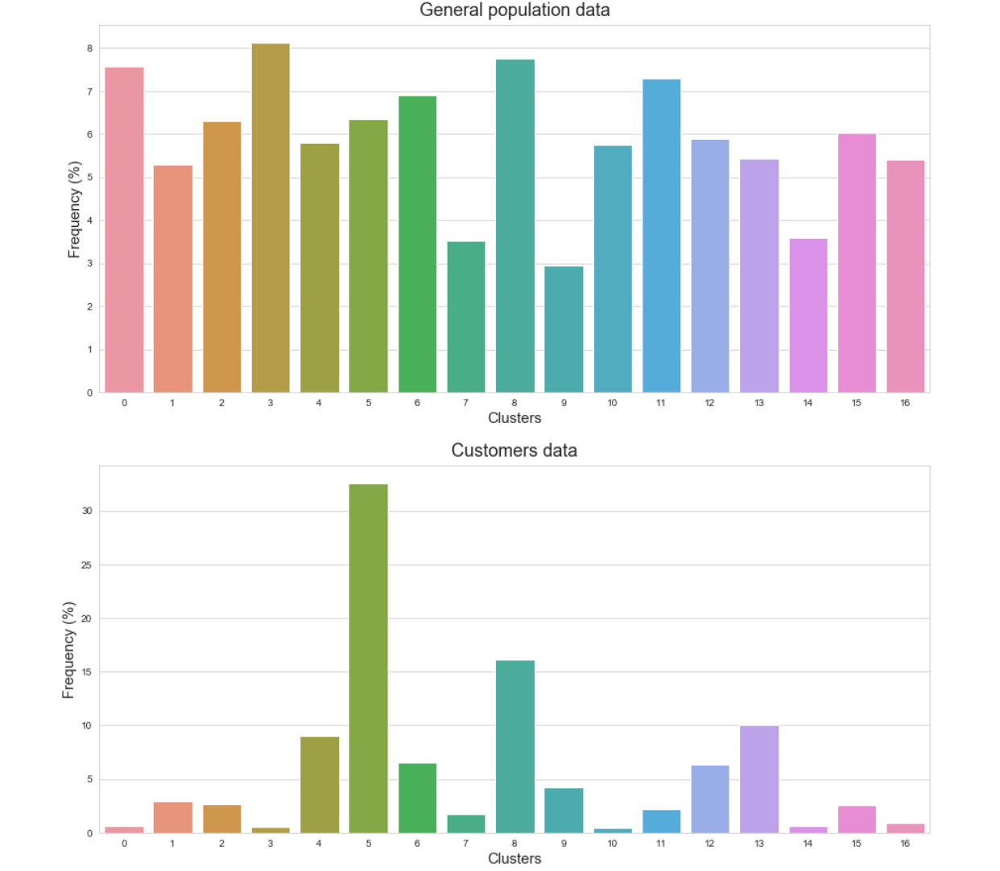

# DataScienceNanodegree
Projects made in the Uacity Data Science Nanodegree Program.

The Udacity DataScience Nanodegree is an online program designed to teach students the tools needed to be a data scientist: data cleaning and engineering, data visualization, data mining, machine learning, deep learning, etc. The program is available here : https://www.udacity.com/course/data-scientist-nanodegree--nd025. 

The programming language used throughout the nanodegree is **Python** . 

The nanodegree is divided in different parts. In each part, there are explanatory lessons, and a project in which the students use what was learned to solve a real-world problem.  

The nanodegree sections are:

### 1. Supervised Learning: 

In this section, we learned different supervised machine learning models: Random Forest, Linear Regression, SVM, etc. We also learned how to measure their performance and compare them to use the best model for a given task. 

For the project, I used different machine learning models to predict if an individual has an income of over 50K based on census data. For this, I compared three different machine learning models, i.e Logistic Regression, Random Forest, and SVM. I also fine tuned the hyperparameters of the best perfoming model to further improve its performance. My jupyter notebook for this project is available here: [Finding donors project](https://github.com/benjamin-dupuis/DataScienceNanodegree/tree/master/Supervised%20Learning/Finding%20Donors%20Project). 

**Technologies used**: Scikit-Learn, Numpy, Pandas, Matplotlib.

 

 

### 2. Deep Learning: 

In this section, we learned how neural networks work in details. We learned the backpropagation algorithm, the activation functions, the regularization techniques, etc. We also learned [Pytorch](https://pytorch.org/), an open-source deep learning framework. 

For the project, I created an image classifier that was able to classify different species of flowers by their image. For this, I used *transfer learning*, which is a technique that utilizes a pre-trained deep learning model to continue its training on new data. In our case, the new data was the dataset containing the images of the flower species. I also created an app that enabled the user to use our code and allowed him to choose his own architecture, hyperparameters, whether or not he wanted to use a GPU, etc. My project can be found here: 
[Image Classifier Project](https://github.com/benjamin-dupuis/DataScienceNanodegree/tree/master/Deep%20Learning/Image%20Classifier%20Project).

**Technologies used**: PyTorch, Scikit-Learn, Numpy, Pandas, Matplotlib.

 

 

### 3. Unsupervised Learning: 

In this section, we learned unsupervised machine learning algorithms that can cluster data (like kMeans), and can reduce the size of a dataset (like PCA). 

For the project, I used **clients data from a real company**, and had to cluster the clients to find target audiences for a mail campaign. For this, I had to clean the data, make data engineering, use PCA to find the most important features, and use the K-Means algorithm to cluster the clients data.  From those clusters, I made a comparison with the general population data to find the target audiences. My project can be found here: 
[Customers Segmentation Project](https://github.com/benjamin-dupuis/DataScienceNanodegree/tree/master/Unsupervised%20Learning/Customers%20Segmentation%20Project).

**Technologies used**: Scikit-Learn, Numpy, Pandas, Matplotlib, seaborn.

 

 

### 4. Intro to Data Science:

In this section, we learned the importance of explaining the data science process to a company's stakeholders as well as the general population. Indeed, a data analysis is nothing without a relevant description.

For the project, I used the data from [Kickstarter](https://www.kickstarter.com/?lang=fr) projects, and implemented a machine learning algorithm that was able to predict whether or not a project was going to be successful. Following my analysis, I also wrote a Medium article vulgarizing my data science process to a general audience. My project can be found here :
[Intro to Data Science Project](https://github.com/benjamin-dupuis/DataScienceNanodegree/tree/master/Intro%20to%20Data%20Science/Kickstarter%20project).

**Technologies used**: Scikit-Learn, Numpy, Pandas, Matplotlib, seaborn.

 

 

### 5. Software Engineering:

In this section, we learned software engineering best practices, as well as Test Driven Development, and how to create and deploy a Python package. We also learned Web Development, and how to create machine learning applications using Flask, Pandas, and Bootstrap.

### 6. Data Engineering:

In this section, we learned how to load data from various sources like JSON files or databases, clean that data, and create new features. Basically, we learned how to implement ETL pipelines, i.e Extract, Transform and Load data, to be able to feed it to a machine learning algorithm. 

For the project, I created an ETL pipeline using disaster response from [**figure-eight**](https://www.figure-eight.com/). I also implemented and tuned a machine learning model that used Natural Language Processing to be able to predict the subject of a help message sent from people in disater situations. Finally, I create a Web application using Flask and Bootstrap that receives a help message and returns the important subjects from those messages, using the trained machine learning model. My project can be found here: [Disaster Response Project](https://github.com/benjamin-dupuis/DataScienceNanodegree/tree/master/Data%20Engineering/Disaster%20Response%20project).

**Technologies used**: Flask, Bootstrap, NLTK, Scikit-Learn, Numpy, Pandas, Plotly.

 

 

### 7. Experimental Designs and Recommendations:

In this section, we learned how to build recommender systems, using three methods: *Knowledge Based Recommendations*, *Collaborative Filtering Based Recommendations* and *Content Based Recommendations*. The first method is simply when a filter is used to recommend a specific category of items to the user. A collaborative filtering approach is when the behavior of all of the other users is taking into consideration. For example, if a user watches a movie, we would find all the users that also watched that movie, and make recommendations based the other movies those users would have watched. Finally, the Content Based approach is when the characteristics of the items are taking into consideration, and are used to find closely related items.

For the project, I worked with the data from users of the IBM Watson Studio's data platform. More specifically, the project consisted of analyzing interactions that users have with articles on that platform, and make recommendations to them about new articles that they were likely to enjoy. My project can be found here: [Recommendations with IBM project](https://github.com/benjamin-dupuis/DataScienceNanodegree/tree/master/Experimental%20Design%20and%20Recommandations/Recommendations%20with%20IBM%20Project).

**Technologies used**: Numpy, Pandas, NLTK, Matplotlib.

 

 

### 8. Capstone Project:

In the final section, we had to choose any data science project that we would like. We had the option to choose from a list of suggested projects, or do a completely different project of our choice. I decided to choose the Starbucks Project. 

For the project, I worked with the data about the offers sent from Starbucks to its clients using the mobile application. That data contained the informations about the offers as well as the users, and the events that resulted from those offers. The goal that I chose to proceed was to be able to predict whether or not a given user would respond positively to a given offer. I also built a Web application to be able to gather the results. My project can be found here: [Capstone project](https://github.com/benjamin-dupuis/DataScienceNanodegree/tree/master/Capstone%20Project).

**Technologies used**: Flask, Bootstrap, Javascript, Plotly, Heroku, Scikit-Learn, Numpy, Pandas.

 

 

## References: 

- [Udacity DSND Term 1](https://github.com/udacity/DSND_Term1)
- [Udacity DSND Term 2](https://github.com/udacity/DSND_Term2)

